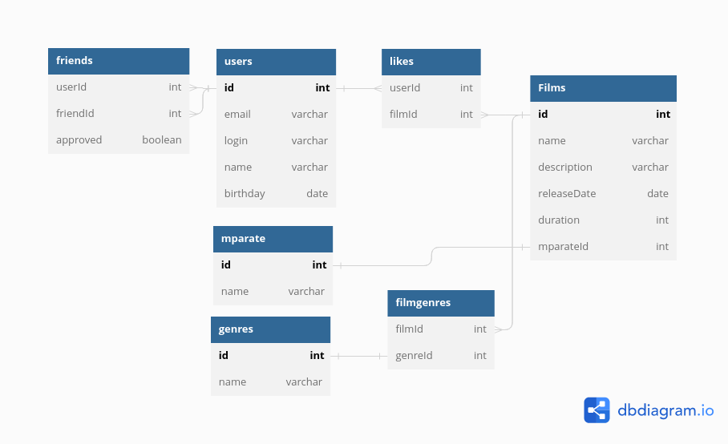

# java-filmorate

### Схема База Данных *java-filmorate*

#### Таблицы с Данными
- **USERS** список пользователей
- **FILMS** список фильмов
- **FRIENDS** связи дружбы между пользователями
- **LIKES** лайки пользователей
- **MPARATE** рейтинг Ассоциации кинокомпаний
- **GENRES** список жанров
- **FILMGENRES** связь фильмов с жанрами

#### Примеры запросов
Список фильмов в жанре "Мультфильм"

*SELECT F.name FROM FILMS as F, FILMGENRES as FG, GENRES as G
WHERE F.id=FG.filmId AND FG.genreId=G.id AND G.name='Мультфильм'*

Список фильмов с рейтингом строго 18+

*SELECT F.name FROM FILMS as F, MPARATE as M
WHERE F.mparateid=M.Id AND M.name='NC-17'*

